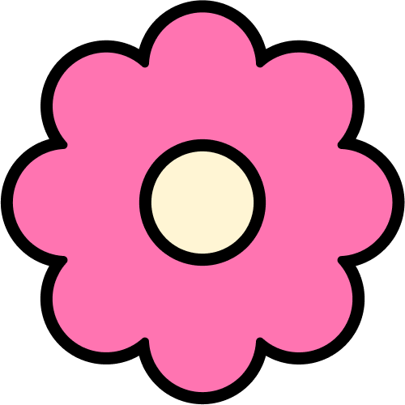
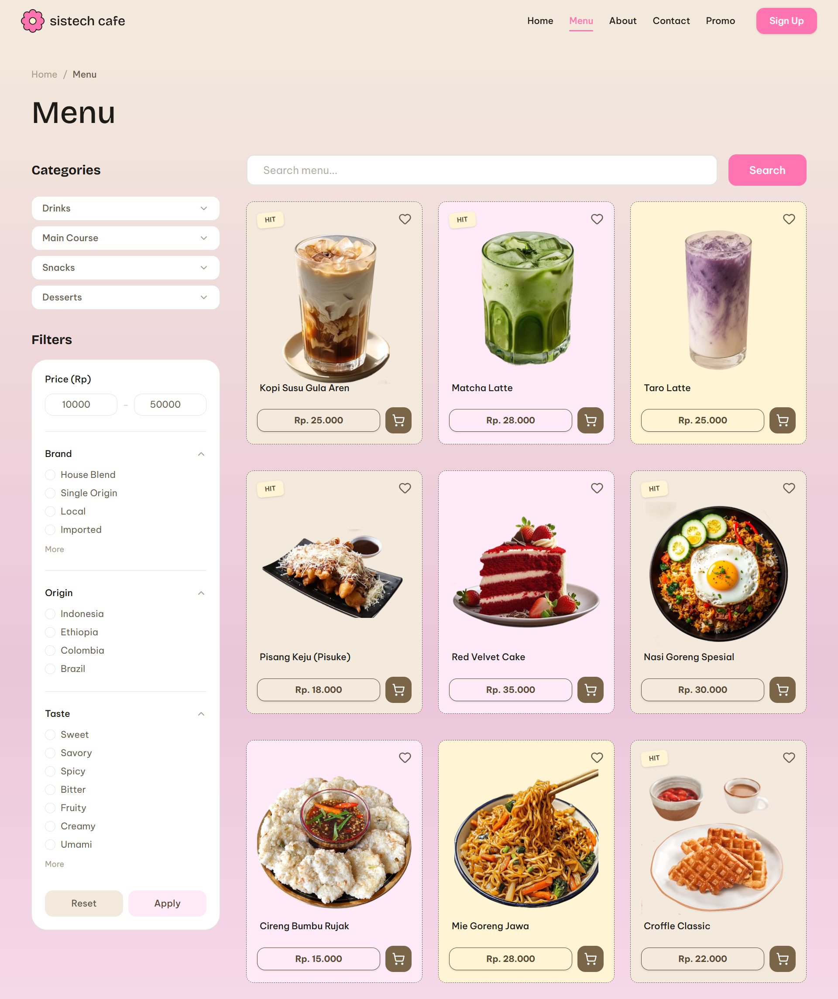

<h1>
  <a href="https://github.com/fatiya17/sistech-cafe">
    <picture>
      <source media="(prefers-color-scheme: dark)" srcset="./public/assets/flower-polos-1.png">
      <source media="(prefers-color-scheme: light)" srcset="./public/assets/flower-polos-2.png">
      
    </picture>
  </a>
  Sistech Cafe
</h1>

**Sistech Cafe** is a modern and interactive website designed for an artisanal coffee shop. It acts as a digital storefront that shows the cafe's unique brand, menu items, and important information for visitors.

This project focuses on providing a smooth and welcoming experience for users, making them feel the warm and cozy atmosphere of the cafe directly through their screens.

[](https://nextjs.org)
[](https://tailwindcss.com)
[](https://gsap.com)
[](https://shields.io/)

<br/>



## About The Project

Sistech Cafe is more than just a place to drink coffee; it is a place where local taste meets modern comfort. This website brings that physical warmth into a digital space. 

The website is built to feel like a fast, single-page application. It features a unique story-style contact form, smooth page layouts, and playful animations that create an engaging and friendly atmosphere for anyone visiting the site.

## Brand Identity & Color Palette

The visual design is built around warm, cozy, and playful colors. Here are the main colors used throughout the website:

| Role | Color Name | Hex Code | Preview |
|------|------------|----------|---------|
| **Primary** | Brand Pink | `#FF74B1` |  |
| **Primary Light**| Soft Pink | `#FFEBF7` |  |
| **Secondary** | Brand Brown | `#574933` |  |
| **Accent** | Tag Yellow | `#FFE479` |  |
| **Background** | Warm Cream | `#F3E9DC` |  |
| **Text Dark** | Near Black | `#1C1B18` |  |
| **Text Body** | Warm Brown | `#675E50` |  |

**Typography:**
- **Headings:** `Bricolage Grotesque` (Strong and bold for large text)
- **Body Text:** `Be Vietnam Pro` (Clean and easy to read for paragraphs)

## Key Features

### Menu Showcase
* **Responsive Layout:** The menu items look great on all devices, adjusting automatically whether you use a mobile phone or a desktop computer.
* **Interactive Design:** Buttons and images respond smoothly when you click or hover over them.
* **Clear Categories:** Labels and tags make it easy to find best-sellers and new items.

### Smooth Animations
* **Scroll Effects:** Characters and text animate nicely as you scroll down the page.
* **Smart Navigation Bar:** The top menu bar changes color when you scroll to make sure the text is always easy to read.

### User Experience
* **Friendly Contact Form:** Instead of boring boxes, the contact page lets you fill in the blanks like writing a letter.
* **Mobile-Friendly:** Designed from the ground up to be easy to tap and navigate on touch screens.

## Technologies Used

* **Next.js:** The core framework used to build the website structure and interactive parts.
* **Tailwind CSS:** A tool to style the website quickly and ensure it looks good on any screen size.
* **GSAP & Framer Motion:** Special libraries used to create smooth, high-quality animations.
* **Lucide React:** A collection of clean and simple icons used across the site.

---

## How to Run the Project

1. **Download the code:**
   ```bash
   git clone https://github.com/fatiya17/sistech-cafe.git
   cd sistech-cafe
   ```

2. **Install what is needed:**
   ```bash
   npm install
   ```

3. **Start the website locally:**
   ```bash
   npm run dev
   ```

4. **View in your browser:**
   Open `http://localhost:3000` to see the website running.

---

## Credits & Authors

**Sistech Cafe Website** is designed and developed by:

* **Fatiya Labibah** - Frontend Developer & Designer

This project is a showcase of building a modern website that combines good design with smooth technical performance.

---
*© 2026 Sistech Cafe.*
